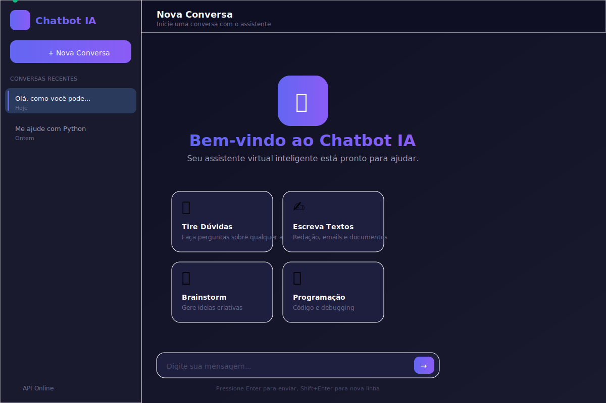
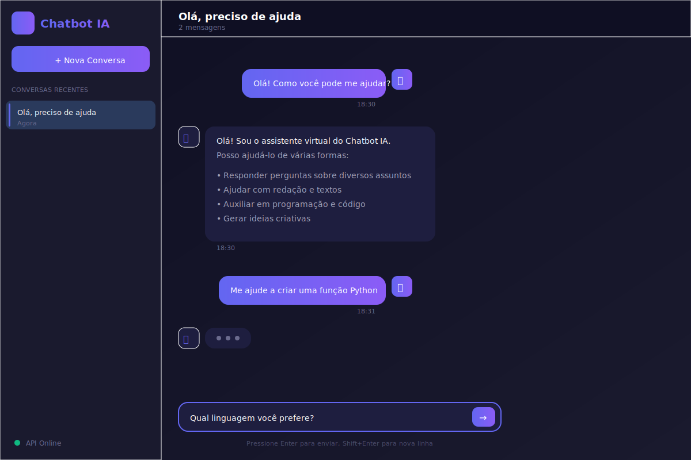

# Chatbot IA API

<div align="center">


**API RESTful para chatbot alimentado por inteligência artificial, com interface moderna e suporte para múltiplos provedores de IA.**

[Demonstração](#demo) • [Instalação](#instalacao) • [Documentação](#endpoints-da-api) • [Contribuir](#licenca)

</div>

---

## 📸 Interface do Sistema

<div align="center">

### Tela Principal - Dark Mode


### Tela de Conversa


</div>

> 🎨 **Design Moderno**: Interface responsiva com suporte a Dark/Light mode, animações suaves e experiência de usuário profissional.

---

## ✨ Características

- 🚀 **API RESTful** completa desenvolvida com FastAPI
- 🤖 **Múltiplos Provedores de IA**: OpenAI, Ollama (local) e Hugging Face
- 💾 **Persistência**: Armazenamento de conversas em SQLite ou PostgreSQL
- 🎨 **Interface Moderna**: Frontend responsivo com tema Dark/Light
- 📚 **Documentação Automática**: Swagger UI e ReDoc
- ✅ **Validação Robusta**: Schemas com Pydantic
- 🔄 **Gerenciamento Completo**: Criar, listar, resetar e deletar conversas
- 📊 **Monitoramento**: Health check e logging estruturado
- 🐳 **Docker Ready**: Containerização pronta para deploy

## Sumario

- [Caracteristicas](#caracteristicas)
- [Requisitos](#requisitos)
- [Instalacao](#instalacao)
- [Configuracao](#configuracao)
- [Execucao](#execucao)
- [Endpoints da API](#endpoints-da-api)
- [Exemplos de Uso](#exemplos-de-uso)
- [Estrutura do Projeto](#estrutura-do-projeto)
- [Testes](#testes)
- [Deploy com Docker](#deploy-com-docker)
- [Licenca](#licenca)

## Requisitos

- Python 3.8 ou superior
- pip ou conda para gerenciamento de pacotes
- Chave de API (OpenAI ou Hugging Face) ou Ollama instalado localmente

## Instalacao

### 1. Clonar o repositorio

```bash
git clone https://github.com/matheussiqueira-dev/chatbot-ia-api.git
cd chatbot-ia-api
```

### 2. Criar ambiente virtual

Windows:
```powershell
python -m venv venv
venv\Scripts\activate
```

Linux/macOS:
```bash
python3 -m venv venv
source venv/bin/activate
```

### 3. Instalar dependencias

```bash
pip install -r requirements.txt
```

## Configuracao

Copie o arquivo de exemplo e configure suas credenciais:

```bash
cp .env.example .env
```

### Provedores de IA Disponiveis

#### OpenAI (Recomendado)

```env
AI_PROVIDER=openai
OPENAI_API_KEY=sk-sua-chave-aqui
OPENAI_MODEL=gpt-3.5-turbo
```

Obtenha sua chave em: https://platform.openai.com/api-keys

#### Ollama (Local)

```env
AI_PROVIDER=ollama
OLLAMA_BASE_URL=http://localhost:11434
OLLAMA_MODEL=mistral
```

Instale o Ollama em https://ollama.ai e execute:
```bash
ollama serve
ollama pull mistral
```

#### Hugging Face

```env
AI_PROVIDER=huggingface
HUGGINGFACE_API_KEY=hf-sua-chave-aqui
HUGGINGFACE_MODEL=mistralai/Mistral-7B-Instruct-v0.1
```

### Configuracoes Adicionais

```env
DATABASE_URL=sqlite:///./chatbot.db
API_HOST=0.0.0.0
API_PORT=8000
API_DEBUG=True
LOG_LEVEL=INFO
TEMPERATURE=0.7
```

## Execucao

### Modo Desenvolvimento

```bash
python -m uvicorn src.main:app --reload
```

### Modo Producao

```bash
python -m uvicorn src.main:app --host 0.0.0.0 --port 8000 --workers 4
```

A API estara disponivel em `http://localhost:8000`

### Documentacao Interativa

- Swagger UI: http://localhost:8000/docs
- ReDoc: http://localhost:8000/redoc

## Endpoints da API

| Metodo | Endpoint | Descricao |
|--------|----------|-----------|
| GET | `/health` | Verificar status da API |
| POST | `/chat` | Enviar mensagem ao chatbot |
| GET | `/conversation/{id}` | Obter historico de conversa |
| GET | `/conversations` | Listar todas as conversas |
| POST | `/conversation/{id}/reset` | Limpar mensagens de uma conversa |
| DELETE | `/conversation/{id}` | Deletar conversa |

### Detalhes dos Endpoints

#### POST /chat

Envia uma mensagem para o chatbot.

Requisicao:
```json
{
  "content": "Sua mensagem aqui",
  "conversation_id": "id-opcional",
  "user_id": "id-do-usuario"
}
```

Resposta:
```json
{
  "id": "msg_123",
  "conversation_id": "conv_456",
  "user_message": "Sua mensagem aqui",
  "ai_response": "Resposta da IA",
  "timestamp": "2024-01-15T10:30:00Z",
  "tokens_used": 45
}
```

#### GET /conversation/{conversation_id}

Retorna o historico completo de uma conversa.

Resposta:
```json
{
  "conversation_id": "conv_456",
  "user_id": "user_001",
  "messages": [...],
  "created_at": "2024-01-15T10:00:00Z",
  "updated_at": "2024-01-15T10:30:00Z",
  "total_messages": 5
}
```

#### GET /conversations

Lista conversas com paginacao.

Parametros:
- `user_id` (opcional): Filtrar por usuario
- `skip` (padrao: 0): Registros a pular
- `limit` (padrao: 10): Maximo de registros

## Exemplos de Uso

### Python

```python
import requests

BASE_URL = "http://localhost:8000"

# Enviar mensagem
response = requests.post(
    f"{BASE_URL}/chat",
    json={
        "content": "O que e machine learning?",
        "user_id": "user_001"
    }
)

result = response.json()
print(f"Resposta: {result['ai_response']}")

# Obter historico
conversation_id = result['conversation_id']
history = requests.get(f"{BASE_URL}/conversation/{conversation_id}")
print(history.json())
```

### cURL

```bash
# Health check
curl http://localhost:8000/health

# Enviar mensagem
curl -X POST http://localhost:8000/chat \
  -H "Content-Type: application/json" \
  -d '{"content":"Ola, como voce pode me ajudar?"}'

# Listar conversas
curl "http://localhost:8000/conversations?limit=10"
```

### JavaScript

```javascript
const response = await fetch('http://localhost:8000/chat', {
  method: 'POST',
  headers: { 'Content-Type': 'application/json' },
  body: JSON.stringify({
    content: 'Como funciona inteligencia artificial?',
    user_id: 'user_001'
  })
});

const data = await response.json();
console.log(data.ai_response);
```

## Estrutura do Projeto

```
chatbot-ia-api/
├── src/
│   ├── main.py                 # Aplicacao FastAPI principal
│   ├── models/
│   │   └── schemas.py          # Schemas Pydantic
│   ├── database/
│   │   ├── config.py           # Configuracao SQLAlchemy
│   │   └── models.py           # Modelos ORM
│   └── services/
│       └── ai_service.py       # Integracao com provedores de IA
├── tests/
│   ├── conftest.py
│   └── test_api.py
├── docs/
│   └── API.md
├── .env.example
├── requirements.txt
├── Dockerfile
├── docker-compose.yml
└── README.md
```

## Testes

Instalar dependencias de desenvolvimento:

```bash
pip install -r requirements-dev.txt
```

Executar testes:

```bash
pytest -v
```

Com cobertura:

```bash
pytest --cov=src tests/
```

## Deploy com Docker

### Build e execucao

```bash
docker build -t chatbot-ia-api .

docker run -p 8000:8000 \
  -e OPENAI_API_KEY=sk-sua-chave \
  -e AI_PROVIDER=openai \
  chatbot-ia-api
```

### Com Docker Compose

```bash
docker-compose up -d
```

## Seguranca

- Variaveis sensiveis armazenadas em arquivo .env
- Validacao de entrada com Pydantic
- Tratamento de erros apropriado
- Logging de atividades
- CORS configuravel

## Melhorias Futuras

- Autenticacao com JWT
- Rate limiting
- Cache de respostas
- Analise de sentimentos
- Suporte multi-idioma
- Webhooks
- Streaming de respostas

## Licenca

Este projeto esta licenciado sob a licenca MIT. Consulte o arquivo LICENSE para mais detalhes.

## Autor

Matheus Siqueira - https://github.com/matheussiqueira-dev

## Suporte

Para duvidas ou problemas, abra uma issue no repositorio GitHub.
