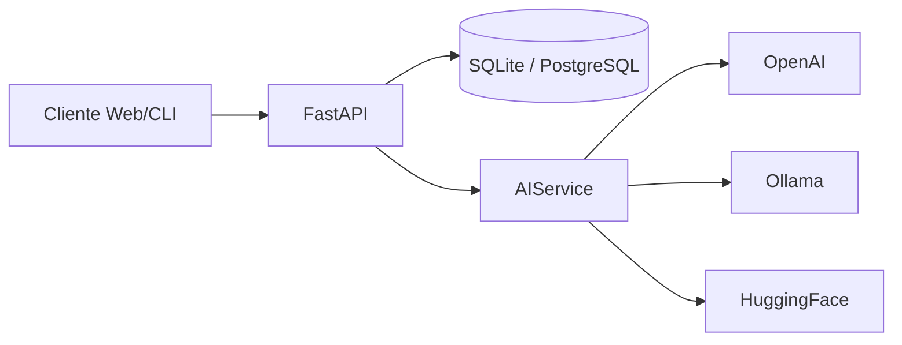

# Chatbot IA API
API RESTful para chatbot com IA + historico persistente  
Portfolio - Janeiro 2026  
Autor: Matheus Siqueira

---

# Problema
- Integracoes de IA variam por provedor e geram alto custo de manutencao
- Sem persistencia, o contexto se perde e a experiencia piora
- Times precisam de uma API padrao, confiavel e facil de evoluir

---

# Solucao
- API unica para conversar com IA
- Multi-provedores: OpenAI, Ollama (local), Hugging Face
- Historico de conversa persistente em banco SQL

---

# Funcionalidades (todas)
- Chat com contexto via POST `/chat`
- CRUD de conversas: listar, resetar, deletar
- Health check e endpoint raiz com info
- Documentacao automatica: Swagger e ReDoc
- Validacao com Pydantic + tratamento de erros
- Logging estruturado e CORS configuravel
- Deploy com Docker e variaveis em `.env`

---

# Arquitetura (alto nivel)

---

# Fluxo do endpoint /chat
1. Cliente envia mensagem
2. API cria ou recupera conversa
3. Recupera historico no banco
4. AIService gera resposta no provedor
5. Mensagem e resposta sao persistidas
6. API retorna resposta + metadados

---

# Endpoints principais
| Metodo | Endpoint | Funcao |
| --- | --- | --- |
| GET | `/health` | status da API |
| GET | `/` | info e links |
| POST | `/chat` | mensagem + resposta |
| GET | `/conversation/{id}` | historico |
| GET | `/conversations` | lista com paginacao |
| POST | `/conversation/{id}/reset` | limpa mensagens |
| DELETE | `/conversation/{id}` | remove conversa |

---

# Demo ao vivo (roteiro)
1. Subir API e abrir `/docs`
2. Health check: `GET /health`
3. Criar conversa: `POST /chat`
4. Continuar conversa: `POST /chat` com `conversation_id`
5. Ver historico: `GET /conversation/{id}`
6. Listar conversas: `GET /conversations?user_id=...`
7. Resetar: `POST /conversation/{id}/reset`
8. Deletar: `DELETE /conversation/{id}`

Arquivos de apoio: `docs/PORTFOLIO_DEMO.md` e `portfolio_demo.py`

---

# Persistencia e dados
- SQLite (dev) ou PostgreSQL (prod)
- Conversas e mensagens separadas
- Contagem de mensagens por conversa
- IDs unicos com UUID

---

# Qualidade e observabilidade
- Validacao de payloads com Pydantic
- Tratamento de erros padronizado
- Logs estruturados no servidor
- Health check com readiness do provedor de IA

---

# Deploy
- Dockerfile + docker-compose
- Variaveis sensiveis em `.env`
- Execucao simples: `docker-compose up -d`

---

# Testes
- Pytest com TestClient do FastAPI
- Health, root e comportamento basico do chat
- Facil de expandir com mocks de IA

---

# Roadmap
- Autenticacao JWT
- Rate limiting
- Cache de respostas
- Streaming de respostas
- Webhooks e analytics

---

# Encerramento
Projeto pronto para uso em portfolio e demos ao vivo.  
Se quiser, posso gerar uma versao em PDF ou HTML.
